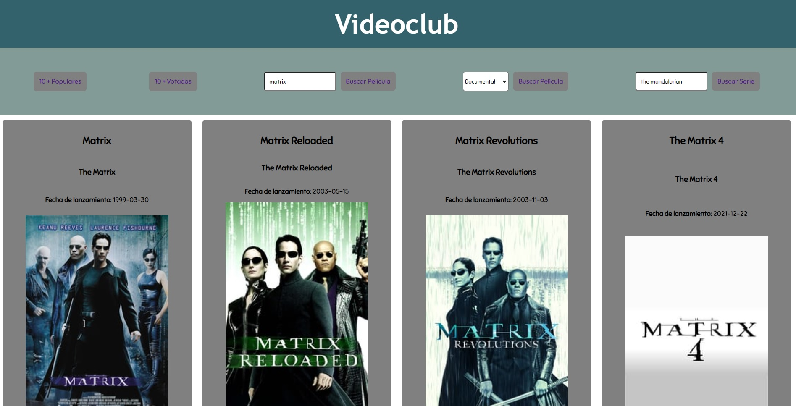

# VIDEOCLUB

<p align="center">
  
</p>

Aplicación Videoclub. A través de ella podemos interactuar con la API de TheMovieDB y obtener datos relativos a dicha
BBDD de películas y series de TV.

## 🛠️ Instalación

Clone el repositorio y despliéguelo en su servidor.

```bash
git clone https://github.com/antoniovalverde/reto4.git
```

## 💻 Uso

En el menú superior tenemos todas las herramientas de interacción con el usuario. Disponemos de dos botones para
mostrar las 10 películas más populares o las 10 películas más votadas. A su vez, mediante un desplegable podemos
filtrar las películas para mostrarlas por género. También, gracias a dos casillas de texto, podemos realizar
búsquedas de películas y series por su título o título original. Finalmente, una vez realizada cualquiera de estas
acciones, se nos mostrarán las películas o series que coincidan con nuestros criterios de búsqueda. En ellas se
mostrará su título, título original, fecha de lanzamiento, imagen relativa a la película o serie, sinopsis,
géneros asociados y el número de votos.


## ⚙️ Herramientas utilizadas 

React - Como librería principal en el frontend
Sass - Para los estilos del sitio
React Route - Para gestionar las rutas dináminas en el proyecto
Axios - Usado para realizar las llamadas a la API de forma asíncrona
Hooks - Utilizados para guardar los diferentes estados de los componentes


## 🚀 Demo 

Aquí puedes probar mi proyecto [DEMO](https://antoniovalverde.github.io/reto4/)


## 🍰 Contribuciones
La ayuda es bienvenida, así como los consejos y demás. No seáis muy duros ya que se trata de mi segundo proyecto en React como parte de un reto del bootcamp que estoy cursando.


## ✨ License
[MIT](https://choosealicense.com/licenses/mit/)


<p align="center">
Desarrollado con ❤️ por Antonio Valverde en España. 
</p>
